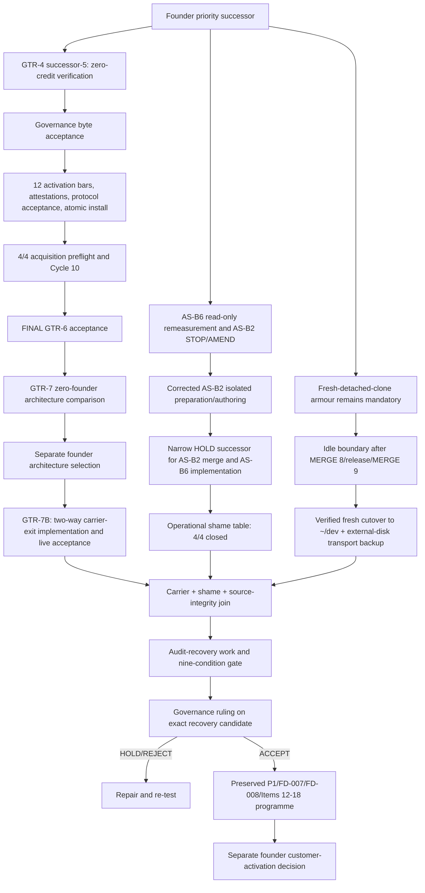

# CyberMeters Canonical Roadmap Sequence Successor

**Roadmap successor ID:** `CM-ROADMAP-2026-08-23-GTR7-COMP-FIRST-001` 
**Governing ruling:** `CM-GOV-2026-08-23-GTR7-COMP-FIRST-001` 
**Audit provenance ruling:** `CM-GOV-2026-08-23-AUDIT-PROVENANCE-001` 
**Supersedes:** only the queue/calendar portions of `CM-ROADMAP-2026-08-23-INTEGRATED-001` 
**Repository adoption:** candidate for a dedicated docs-only adoption change; repository canonical files remain authoritative until that change is accepted 
**Production:** **HOLD**

## 1. New critical path

## 2. Gate 0 — preserve and stop false progress

Until the carrier/shame/source-integrity join gate closes:

- do not assemble or nominate an audit recovery candidate;
- do not claim 2026-09-01 release readiness;
- preserve the completed audit, rebuttal, adjudication, Item 12, and Item 13 artifacts unchanged;
- consume the audit corpus only through `05-AUDIT-SOURCE-PROVENANCE-ADJUDICATION.md`: Codex matrix first, second Claude rebuttal as the challenge layer, and the named exclusions applied;
- keep the audited and planning worktrees clean;
- never treat the iCloud-managed old primary checkout or its local refs as current source;
- require a fresh detached local-disk clone, independently obtained commit identity, object-existence check, and discriminating marker for every source-bearing analysis, implementation, verification, build, and deployment until the relocation gate closes;
- allow read-only measurement, corrected AS-B2 preparation/isolated authoring with zero merge credit, existing GTR-authorised actions, and narrowly justified emergency containment of an active safety risk;
- do not merge broad feature work, activate a customer, import customer data, cut over billing, or deploy a competitor-depth feature under this priority document.

## 3. Gate 1 — complete the current GTR prerequisite

Owner lanes remain those already bound by the GTR artifacts. No new parallel successor is invented.

Exit requires:

- seq329 exact bytes pass a fresh zero-credit Left verification;
- Governance accepts those exact bytes;
- activation passes all 12 bars;
- whole-package verification and two separate real-launcher attestations pass;
- Governance protocol acceptance is FINAL;
- atomic install and rollback evidence is accepted;
- the installed version identities are recorded exactly.

Any changed byte creates a new candidate and resets candidate credit.

## 4. Gate 2 — GTR-6 acceptance

Run the frozen 4/4 target-host acquisition preflight and a fresh Cycle 10 with no in-cycle retry. Require independent Right observation, PMO reconciliation, a separate FINAL Class-S GTR-6 route-acceptance ruling, and distinct founder live acceptance.

Exit is binary: a qualifying accepted cycle exists or it does not. Prior route successes, rejected matters, and fail-closed cycles are valuable evidence but cannot be aggregated into acceptance.

## 5. Gate 3 — GTR-7 comparison and GTR-7B Carrier-Exit Gate

GTR-7 first compares admissible zero-founder cloud/remote architectures. It must evaluate both evidence submission and ruling return, including authentication, freshness, confidentiality, least privilege, append-only publication, failure handling, cost, and founder effort.

GTR-7 comparison does not close the gate. A separate formal `GTR-7B` successor scope is required. After the report:

1. founder selects an architecture or rejects all candidates;
2. a separate bounded implementation authority is frozen;
3. author and independent verifier implement/test it;
4. a two-direction live exercise proves zero routine founder payload transport;
5. Governance issues a FINAL carrier-exit acceptance;
6. founder separately accepts the operational outcome.

If no option can prove the inbound ruling leg and principal separation, the gate remains open even if the evidence-read leg works.

## 6. Gate 4 — competitor/shame truth

### 4A — read-only rebaseline, parallel now

Refresh the operational four shame rows (the historical combined honesty row split into two) and the broader 22-axis matrix against:

- current exact source commit;
- intended release configuration;
- tests and reachable consumers;
- staging/deployed identities where authorised;
- dated, primary-source competitor evidence.

This work may start now in parallel with GTR, use the preserved Item 13A reachability instrument in read-only mode, and run the AS-B6 map. It grants no deletion, activation, merge, or feature authority.

### 4B — narrow implementation authority

Because the Phase-3 `HOLD` forbids unrelated feature work, freeze a successor authority naming only:

- AS-B2 methodology implementation and its P1/serviceability prerequisite;
- AS-B6a/B6b implementation and its capacity, Item 13A, and F-041 safety prerequisites;
- exact files, branches, test bars, verifier separation, staging/live boundary, and rollback.

The already-deployed false-claim slice is reverified, not rebuilt.

### 4C — four-row acceptance

Exit requires all four operational rows `CLOSED` on exact accepted identities. `WORKORDER WRITTEN`, `IN PR`, `MAPPED`, `POLICY WRITTEN`, `FLAG EXISTS`, or `PLANNED` is not closed.

The 23-Aug local AS-B2 workorder must `STOP/AMEND` to the accepted policy: plain version-blind CVE notes remain informational; Stage-1 deduction is serviceability-gated KEV only; Stage 2 waits for AS-B5. Corrected isolated authoring may then proceed now in parallel, but earns no merge/acceptance credit. The 23-Aug AS-B6 handoff may run now to refresh measurement read-only but cannot authorise a flag/config change. Neither local handoff appears in the canonical ledger through seq330.

The full 22-axis FD-008 programme remains a later mandatory predecessor to customer/public-beta progression. Pulling all 22 ahead requires a separate founder/governance successor, especially for AS-Bgated.

## 7. Gate 5 — source-integrity relocation and independent backup

This is a third prerequisite lane into the join, not post-release housekeeping. The permanent correction is a verified fresh-clone cutover to `/Users/turhanacar/dev/CyberMeters-Platform`, not a blind move of the stale/cloud-mediated `.git` object store.

The measured old root is not clean: it is behind its recorded upstream by three, has at least two modified paths, and a status read timed out. Eleven nested `.worktrees/` directories exist; old Git metadata has 67 registered worktrees, 53 marked prunable and 14 not marked prunable. The cutover must therefore preserve and reconcile state before pruning or removing anything.

Run the physical cutover only at the first idle boundary after MERGE 8, its release/two-Worker deployment, and MERGE 9 have completed and all old-path-bound processes have stopped. Until then, the fresh-detached-clone armour in Gate 0 remains mandatory.

Exit requires:

- complete inventory and disposition of old-path sessions, branches, dirty paths, local-only commits, worktrees, memory, launchers, and scripts;
- a clean full clone at `/Users/turhanacar/dev/CyberMeters-Platform`, independently bound to the canonical remote and intended commit;
- reviewed migration of only intentional local state, without copying the old `.git` store;
- hash-verified migration of path-keyed Claude memory and removal of unexplained active old-path references;
- successful source-bind/build/test preflight that does not read the old checkout;
- an initial full `cybermeters-ops/transport` snapshot to the founder-selected external disk, with a SHA-256 manifest and restore-to-scratch PASS; and
- independent cutover review.

The two dated local ledger copies are useful but share `/dev/disk3s5`, and the newest reproduced copy stops at sequence 327 while the current ledger is sequence 330. They do not satisfy independent backup or prove a scheduled daily cadence. Cutover must establish, schedule, monitor, and verify a daily sealed local-ledger job. No more than seven calendar days may elapse between verified external generations, and an additional generation is taken after major accepted transport/governance milestones or before destructive maintenance. Missing that interval reopens/degrades the backup gate and blocks destructive maintenance and audit-recovery candidate assembly, progression, and acceptance until recovery.

The detailed non-destructive procedure and fail-closed conditions are in `05-SOURCE-INTEGRITY-RELOCATION-GATE.md`. Pruning or removing a worktree, deleting the old checkout, blindly moving the old object store, or deploying from the cutover is not authorised by this roadmap and requires later explicit authority.

The completed provenance adjudication is a subcontrol of this lane, not Gate-5 closure. It establishes that the audit corpus remains usable under bounded exclusions; it does not replace the `/Users/turhanacar/dev` cutover, independent backup, restore proof, or exact-candidate re-binding.

## 8. Gate 6 — audit recovery

Only after Gates 1–5 close may the integration authority begin recovery-candidate assembly. The candidate must be assembled from the verified `/Users/turhanacar/dev` full clone and rebound to an exact remote commit/tree. Apply the governing provenance hierarchy, re-baseline `F-026`, and reproduce every surviving blocker on the exact candidate. The predecessor roadmap's work packages remain intact:

- migration assurance: `F-025` + `F-035`;
- privacy and tenant boundary: `F-009`, `F-021`;
- capacity/completeness and notification truth: `F-026`, `F-030`;
- operational evidence: `F-004`, `F-027`;
- all three `F-041` sink families fixed or demonstrably disabled;
- clean-checkout build/test/type/security gates;
- production-like staging identity, schema, queue/DLQ, monitoring, rollback evidence;
- distinct independent verification and a new manifest;
- new Governance ruling on exact release-candidate bytes.

The nine Phase-3 conditions remain cumulative. Earlier GTR, shame, or source-integrity acceptance does not satisfy an audit closure by implication.

## 9. Post-recovery programme preserved

After a Governance recovery `ACCEPT`, continue the predecessor integrated plan without discarding sunk work:

1. reconcile/complete remaining P1.2–P1.5 commitments not already consumed as shame prerequisites;
2. execute FD-007 and the remaining FD-008 22-axis programme in their accepted dependency order;
3. complete Item 12.1–12.4 using the preserved B1 foundation, maps, rulings, and selectively ported commits;
4. rerun Item 13A on the exact candidate; keep Item 13B mutation founder/governance-gated;
5. complete founder acceptance, independent authenticated pentest/retest, legal/billing/claims gates, controlled first-customer acceptance, and final public-beta gates.

No Item 12/13 work is discarded. Work pulled forward for AS-B2/AS-B6 receives dual credit only when separately proven against each programme's own acceptance contract.

## 10. Schedule policy

The old 2026-09-01 recovery-candidate target is superseded by evidence gates. On 2026-09-01, report:

- exact GTR transport head and accepted gates;
- whether GTR-6 is FINAL;
- whether the GTR-7 comparison is complete;
- whether a separate founder architecture selection is recorded;
- whether GTR-7B carrier-exit acceptance is FINAL;
- operational shame-table status out of 4;
- whether the source-integrity cutover and independent external-disk backup gate is closed;
- any new authorised recovery-candidate date, with dependencies.

Do not backsolve acceptance from the calendar. Reforecast only after the successor-5 outcome, GTR-6 acceptance, GTR-7 architecture sizing, shame-scope authority, and source-integrity cutover outcome are known.

## 11. Single source-of-truth adoption

This package is a successor proposal, not a silent edit of the sealed predecessor package. Adoption should be one docs-only change that:

- adds this ruling and sequence to the repository governance/roadmap corpus;
- marks the prior audit-first calendar clauses superseded without rewriting history;
- records the exact founder wording and evidence hashes;
- adds the iCloud source-integrity relocation and external-disk backup gate;
- adopts the bounded audit-source provenance ruling and its exact exclusions without altering the sealed audit/rebuttal inputs;
- updates `CLAUDE.md`/execution-board priority pointers without changing technical acceptance facts;
- leaves the Phase-3 blocker ledger and all prior manifests byte-identical.

Until that adoption change is independently reviewed and merged, this package governs the founder-authorised planning decision in this workspace; repository canonical documents remain the formal source for implementation authority.
